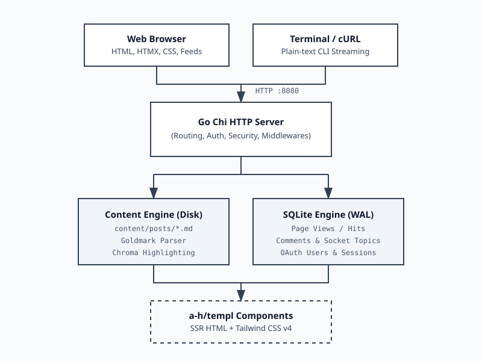

# daemontalk

[](https://github.com/dafagareth/daemontalk/actions/workflows/ci.yml)
[](https://github.com/dafagareth/daemontalk/actions/workflows/deploy.yml)
[](LICENSE)
[](go.mod)

`daemontalk` is an engineering publication, systems knowledge graph, and interactive UNIX playground. Built as a single standalone Go binary, it features a custom TUI over SSH, a virtual in-browser UNIX shell, and a high-performance SSR engine using HTMX and Tailwind CSS v4.

<p align="center">
  
</p>

## Primary Capabilities

- Interactive Bubble Tea terminal client accessible directly via SSH (`ssh.daemontalk.com -p 2222`).
- In-browser virtual UNIX shell (`/terminal`) with a simulated POSIX file system and 40+ commands.
- High-performance SSR blogging engine with in-memory full-text HTMX search and zero JS frameworks.
- Anonymous SQLite-backed guestbook with deterministic persistent visitor handles.
- Automated OpenGraph image generator, RSS 2.0 feed, JSON Feed, and XML Sitemaps.
- Robust editorial Markdown rendering with syntax highlighting, responsive carousels, and galleries.

## Quick Start

Launch the interactive TUI over SSH:
```bash
$ ssh ssh.daemontalk.com -p 2222
```

Stream daily engineering dispatches via curl:
```bash
$ curl -sL daemontalk.com/daily
```

Install the standalone CLI binary locally:
```bash
$ curl -sL https://daemontalk.com/install.sh | bash
```

## Documentation and Specifications

Refer to [docs/VPS_SETUP.md](docs/VPS_SETUP.md) for production deployment instructions using Docker, Caddy, and UFW.

Refer to [CONTRIBUTING.md](CONTRIBUTING.md) for development setup (Docker vs local) and contribution standards.

## License

Source code is released under the Non-Commercial Source-Available License. The "daemontalk" name and original written content are reserved. See [LICENSE](LICENSE) for terms.
